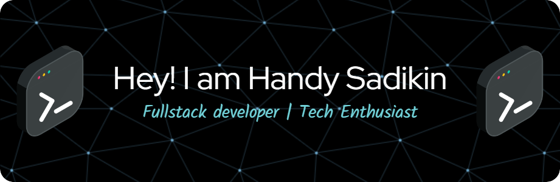

### Hi there 👋

- 🌱 Assalamu'alaikum I’m Handy
- 👯 I’m looking to collaborate to share code on any projects
- ⚡ I’m currently working with React,Python,Laravel,Flutter

##### Skill

<!---
- 💬 Ask me about ...
- 📫 How to reach me: ...
- 😄 Pronouns: ...
- ⚡ Fun fact: ...-->
